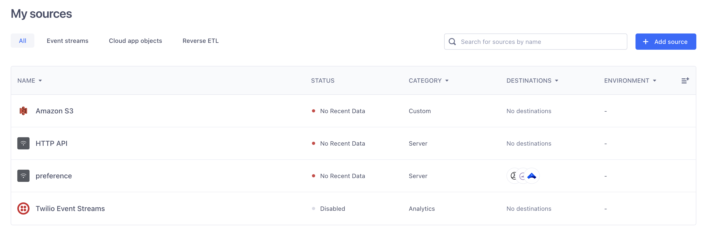

# Conversation Relay Sample App, Low code with Airtable

Twilio gives you a superpower called Conversation Relay, it provides a Websocket connection, STT and TTS integrated with optimised latency, so you can easily build a voice bot with your own LLM.

This app serves as a demo exploring:

- Conversation Relay features
- [OpenAI](https://openai.com) for GPT prompt completion
- Low code options with Airtable, so easy to build different use cases.

Features:

- 🏁 Returns responses with low latency, typically 1 second by utilizing streaming.
- ❗️ Allows the user to tweak the promt via Airtable to build different use cases.
- 📔 Maintains chat history with GPT.
- 🛠️ Allows the GPT to call external tools, currently support:
  - getWeather from openweathermap
  - changeLanguage during the conversation
  - placeOrder(simulate confirm and send SMS)

## Setting up for Development

### Prerequisites

Sign up for the following services and get an API key for each:

- [Airtable](https://www.airtable.com)
- [OpenAI](https://platform.openai.com/signup)
- [Twilio](https://www.twilio.com)
- [Openweathermap](http://api.openweathermap.org)

You should get your Twilio Account Flag (Voice - Enable Conversation Relay) enabled as well.

If you're hosting the app locally, we also recommend using a tunneling service like [ngrok](https://ngrok.com) so that Twilio can forward audio to your app.

### 1. Configure Environment Variables

Copy `.env.example` to `.env` and configure the environment variables.

### 2. Install Dependencies with NPM

Install the necessary packages:

```bash
npm install
```

### 3. Configure Airtable

Copy the table below to your own space, or create table with the same fields.

[Airtable Sample](https://airtable.com/appVS1logGSka8kfl/shr5OQbscAC3SCZB5)

Make sure the name of your table is 'builder'.

You can add a new record with your own prompt. The most recently updated record will be read when a call is incoming, and the fields in the record will be used to provision Conv-Relay and GPT.


You can generate Airtable access tokens at the [link](https://airtable.com/create/tokens), and the base ID should be a string similar to 'appUnia3pFUA5rPlr' in your table's URL. Make sure to set both the access token and base ID correctly in your .env file.

### 4. Configure Visibilty App

```bash
cd visibility-app
npm install
cp env.example .env
```

In your Twilio Account create a Twiml App and configure the incoming voice url to accept your incoming call e.g. "https://your-server.ngrok.io/incoming" update .env with your Twiml App sid

### 5. Start Ngrok

Start an [ngrok](https://ngrok.com) tunnel for port `3000`:

```bash
ngrok http 3000
```

Ngrok will give you a unique URL, like `abc123.ngrok.io`. Copy the URL without http:// or https://, set this for 'SERVER' in your .env.

### 6 Start Your Server in Development Mode

Run the following command:

```bash
npm run dev
```

This will start your app using `nodemon` so that any changes to your code automatically refreshes and restarts the server.

### 6.1 Start Your React App in Development Mode

Run the following command: (you will need to run on a different port from your server)

```bash
cd visibility-app
npm run dev
```

### 7. Configure an Incoming Phone Number

Connect a phone number using the [Twilio Console](https://console.twilio.com/us1/develop/phone-numbers/manage/incoming).

You can also use the Twilio CLI:

```bash
twilio phone-numbers:update +1[your-twilio-number] --voice-url=https://your-server.ngrok.io/incoming
```

This configuration tells Twilio to send incoming call audio to your app when someone calls your number. The app responds to the incoming call webhook with a [Stream](https://www.twilio.com/docs/voice/twiml/stream) TwiML verb that will connect an audio media stream to your websocket server.

### 8. Modifying the ChatGPT Context & Prompt

- You can tweak the prompt and some other options via Airtable, either modify your record directly, or create and use your Airtable form as below.


### 9. Monitor and Logs

You can monitor logs at https://you-server-address/monitor


## Deploying to Fly.io

> Deploying to Fly.io is not required to try the app, but can be helpful if your home internet speed is variable.

Modify the app name `fly.toml` to be a unique value (this must be globally unique).

Deploy the app using the Fly.io CLI:

```bash
fly launch

fly deploy
```

Update the 'SERVER' in .env with the fly.io server you get.

Import your secrets from your .env file to your deployed app:

```bash
fly secrets import < .env
```

## Bonus: Use Segment for Personalization

In this app, user profiles and order history are stored in Airtable and remain static. For dynamic user data, you can use [Segment](https://segment.com) to store and retrieve profiles and events, such as order summaries.

Utilize the helper functions in `segment-service.js`: use `addUser()` to add a new user profile, and `addEvent()` to log a new order. Once the events are recorded, you can read them with `getEvents()`and incorporate them into GPT prompts to personalize the conversation.

Follow the steps below to set up Segment and update `WRITE_KEY`, `SPACE_ID`, `PROFILE_TOKEN` in .env file.

- Create a HTTP API source and note down the write key
  

- Connect this source to your profile sources
  

- Genereate API token for the profile API
  
